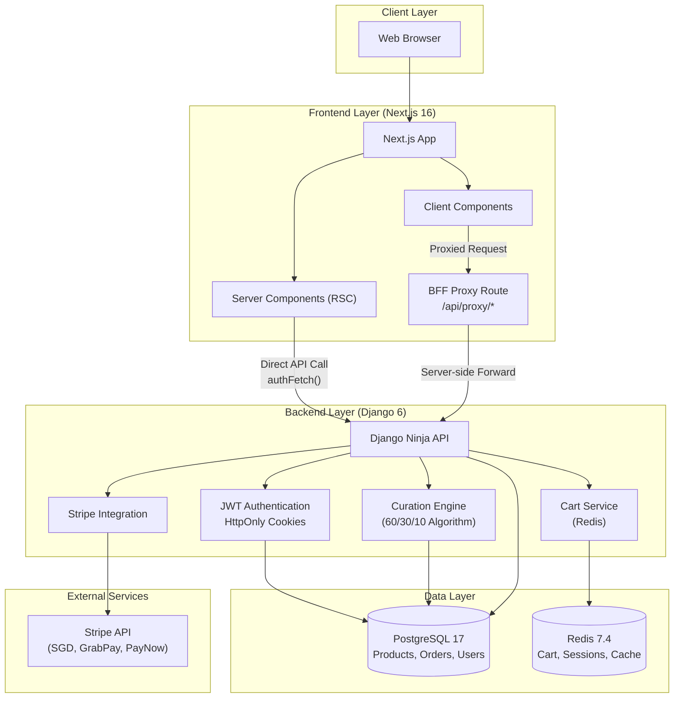

# 茶源 CHA YUAN

<div align="center">


**Premium Tea E-Commerce Platform for Singapore**

[](https://nextjs.org/)
[](https://react.dev/)
[](https://www.djangoproject.com/)
[](https://www.postgresql.org/)
[](https://redis.io/)
[](https://www.typescriptlang.org/)

[](#singapore-market-context)
[](https://www.mas.gov.sg/)
[](https://en.wikipedia.org/wiki/Singapore_Time)

</div>

---

## 🍵 Overview

**CHA YUAN (茶源)** is a premium tea e-commerce platform exclusively designed for the Singapore market. We bridge Eastern tea heritage with modern lifestyle commerce, offering a curated selection of premium teas from heritage gardens across China, Taiwan, Japan, and India.

### The Tea Commerce Problem

- **Overwhelming Selection**: Consumers face hundreds of tea varieties without guidance
- **Quality Uncertainty**: Origin authenticity and harvest quality are hard to verify
- **Personalization Gap**: No tailored recommendations based on taste preferences
- **Singapore Market Needs**: Local GST compliance (9%), SGD pricing, regional delivery

### Our Solution

- ✨ **Preference Quiz**: One-time onboarding quiz determines tea preferences using weighted scoring
- 🎯 **Curated Subscription**: Monthly tea boxes automatically curated based on preferences + season
- 📚 **Educational Content**: Brewing guides, tasting notes, and tea culture articles
- 🇸🇬 **Singapore-Ready**: GST-inclusive pricing, local address format, PDPA compliance

---

## 🏗️ Tech Stack

| Layer | Technology | Version | Purpose |
|-------|-----------|---------|---------|
| **Frontend** | Next.js | 16.2.3+ | App Router, Server Components, Turbopack |
| **Framework** | React | 19.2.5+ | Concurrent features, Server Actions |
| **Styling** | Tailwind CSS | v4.2.2 | CSS-first theming, OKLCH colors |
| **Animations** | Framer Motion | 12.38.0+ | Smooth micro-interactions |
| **State** | TanStack Query | 5.99.0+ | Server state management |
| **Backend** | Django | 6.0.4+ | Python 3.12+, Async support |
| **API** | Django Ninja | 1.6.2+ | Pydantic v2 validation |
| **Database** | PostgreSQL | 17 | JSONB optimization |
| **Cache** | Redis | 7.4-alpine | Sessions, cart persistence (30-day TTL) |
| **Auth** | JWT + HttpOnly Cookies | - | XSS protection via BFF pattern |
| **Payment** | Stripe | 14.4.1+ | SGD, GrabPay, PayNow |
| **Testing** | Vitest + Playwright | Latest | Unit + E2E test coverage |

---

## 🗂️ Application Architecture

### File Hierarchy

```
cha-yuan/
├── 📁 backend/                    # Django 6 Backend
│   ├── 📄 api_registry.py         # Centralized API router (CRITICAL)
│   ├── 📁 apps/
│   │   ├── 📁 api/v1/            # Django Ninja API endpoints
│   │   │   ├── 📄 products.py    # Product catalog API
│   │   │   ├── 📄 cart.py        # Shopping cart API
│   │   │   ├── 📄 checkout.py    # Stripe checkout & webhooks
│   │   │   ├── 📄 content.py     # Articles & culture API
│   │   │   ├── 📄 quiz.py        # Quiz & preferences API
│   │   │   └── 📄 subscriptions.py # Subscription management
│   │   ├── 📁 commerce/          # Product, Order, Subscription
│   │   │   ├── 📄 models.py      # Product, Origin, TeaCategory models
│   │   │   ├── 📄 cart.py        # Redis cart service (418 lines)
│   │   │   ├── 📄 curation.py    # AI curation algorithm (60/30/10)
│   │   │   ├── 📄 stripe_sg.py   # Singapore Stripe integration
│   │   │   ├── 📄 admin.py       # Django Admin customization
│   │   │   └── 📁 management/commands/
│   │   │       ├── 📄 seed_products.py  # Seed 12 premium teas
│   │   │       └── 📄 __init__.py
│   │   ├── 📁 content/           # Quiz, Articles, User Preferences
│   │   │   ├── 📄 models.py      # QuizQuestion, QuizChoice, UserPreference
│   │   │   ├── 📄 admin.py       # Quiz admin with inline choices
│   │   │   └── 📁 management/commands/
│   │   │       ├── 📄 seed_quiz.py    # Seed 6 quiz questions
│   │   │       └── 📄 __init__.py
│   │   └── 📁 core/              # Users, Auth, Singapore Utilities
│   │       ├── 📄 models.py      # User with SG validation
│   │       ├── 📄 authentication.py  # JWT + HttpOnly cookies
│   │       ├── 📄 admin.py       # User admin
│   │       └── 📁 sg/            # Singapore-specific utilities
│   │           ├── 📄 validators.py   # Phone, postal code validation
│   │           └── 📄 pricing.py      # GST calculation
│   ├── 📁 chayuan/               # Django project config
│   │   ├── 📁 settings/          # Environment-specific settings
│   │   │   ├── 📄 base.py
│   │   │   ├── 📄 development.py
│   │   │   └── 📄 production.py
│   │   └── 📄 urls.py            # URL configuration
│   └── 📁 requirements/          # Python dependencies
│       ├── 📄 base.txt
│       ├── 📄 development.txt
│       └── 📄 production.txt
│
├── 📁 frontend/                  # Next.js 16 Frontend
│   ├── 📁 app/                   # App Router (Next.js 16)
│   │   ├── 📄 page.tsx           # Home page (Hero landing)
│   │   ├── 📄 layout.tsx         # Root layout with fonts
│   │   ├── 📄 globals.css        # Tailwind v4 theme (349 lines)
│   │   ├── 📁 api/proxy/[...path]/
│   │   │   └── 📄 route.ts       # BFF Proxy Route
│   │   ├── 📁 products/
│   │   │   ├── 📄 page.tsx       # Product catalog (Server Component)
│   │   │   ├── 📁 [slug]/
│   │   │   │   └── 📄 page.tsx   # Product detail (Dynamic)
│   │   │   └── 📁 components/
│   │   │       └── 📄 product-catalog.tsx  # Client Component
│   │   ├── 📁 culture/
│   │   │   ├── 📄 page.tsx       # Articles listing
│   │   │   └── 📁 [slug]/
│   │   │       └── 📄 page.tsx   # Article detail
│   │   ├── 📁 quiz/
│   │   │   ├── 📄 page.tsx       # Quiz intro
│   │   │   └── 📁 components/
│   │   │       ├── 📄 quiz-intro.tsx
│   │   │       ├── 📄 quiz-question.tsx
│   │   │       └── 📄 quiz-results.tsx
│   │   ├── 📁 checkout/
│   │   │   ├── 📄 page.tsx
│   │   │   ├── 📁 success/
│   │   │   │   └── 📄 page.tsx
│   │   │   └── 📁 cancel/
│   │   │       └── 📄 page.tsx
│   │   ├── 📁 dashboard/subscription/
│   │   │   ├── 📄 page.tsx       # Subscription dashboard
│   │   │   └── 📁 components/
│   │   │       ├── 📄 subscription-status.tsx
│   │   │       ├── 📄 next-billing.tsx
│   │   │       ├── 📄 next-box-preview.tsx
│   │   │       ├── 📄 preference-summary.tsx
│   │   │       └── 📄 cancel-subscription.tsx
│   │   └── 📁 shop/
│   │       └── 📄 page.tsx       # Redirects to /products
│   │
│   ├── 📁 components/
│   │   ├── 📁 ui/                # shadcn primitives
│   │   │   ├── 📄 button.tsx
│   │   │   ├── 📄 input.tsx
│   │   │   ├── 📄 label.tsx
│   │   │   ├── 📄 sheet.tsx
│   │   │   ├── 📄 scroll-area.tsx
│   │   │   └── 📄 separator.tsx
│   │   ├── 📁 sections/          # Page sections
│   │   │   ├── 📄 hero.tsx
│   │   │   ├── 📄 navigation.tsx
│   │   │   ├── 📄 philosophy.tsx
│   │   │   ├── 📄 collection.tsx
│   │   │   ├── 📄 culture.tsx
│   │   │   ├── 📄 shop-cta.tsx
│   │   │   ├── 📄 subscribe.tsx
│   │   │   └── 📄 footer.tsx
│   │   ├── 📄 product-card.tsx
│   │   ├── 📄 product-grid.tsx
│   │   ├── 📄 product-gallery.tsx
│   │   ├── 📄 related-products.tsx
│   │   ├── 📄 filter-sidebar.tsx
│   │   ├── 📄 article-card.tsx
│   │   ├── 📄 article-grid.tsx
│   │   ├── 📄 article-content.tsx
│   │   ├── 📄 category-badge.tsx
│   │   ├── 📄 gst-badge.tsx
│   │   ├── 📄 cart-drawer.tsx
│   │   └── 📄 sg-address-form.tsx
│   │
│   ├── 📁 lib/                   # Utilities & API
│   │   ├── 📁 api/
│   │   │   ├── 📄 products.ts    # Product API
│   │   │   ├── 📄 quiz.ts        # Quiz API
│   │   │   └── 📄 subscription.ts  # Subscription API
│   │   ├── 📁 types/
│   │   │   ├── 📄 product.ts
│   │   │   ├── 📄 quiz.ts
│   │   │   └── 📄 subscription.ts
│   │   ├── 📁 hooks/
│   │   │   └── 📄 use-subscription.ts
│   │   ├── 📄 auth-fetch.ts      # BFF wrapper (148 lines)
│   │   ├── 📄 animations.ts      # Framer Motion variants
│   │   └── 📄 utils.ts
│   │
│   ├── 📁 public/images/         # Static assets
│   ├── 📄 next.config.ts
│   ├── 📄 package.json
│   └── 📄 tsconfig.json
│
├── 📁 infra/docker/              # Docker Infrastructure
│   ├── 📄 docker-compose.yml     # PostgreSQL 17 + Redis 7.4
│   ├── 📄 Dockerfile.backend.dev
│   └── 📄 Dockerfile.frontend.dev
│
├── 📁 docs/                      # Documentation
│   ├── 📄 PHASE_0_SUBPLAN.md     # Foundation & Docker
│   ├── 📄 PHASE_1_SUBPLAN.md     # Backend Models
│   ├── 📄 PHASE_2_SUBPLAN.md     # JWT Auth + BFF
│   ├── 📄 PHASE_3_SUBPLAN.md     # Design System
│   ├── 📄 PHASE_4_SUBPLAN.md     # Product Catalog
│   ├── 📄 PHASE_5_SUBPLAN.md     # Cart & Checkout
│   ├── 📄 PHASE_6_SUBPLAN.md     # Tea Culture
│   ├── 📄 PHASE_7_SUBPLAN.md     # Quiz & Subscription
│   └── 📄 Project_Architecture_Document.md
│
├── 📁 plan/                      # Planning documents
│   ├── 📄 MASTER_EXECUTION_PLAN.md
│   └── 📄 Project_Requirements_Document.md
│
├── 📄 CLAUDE.md                  # Concise agent briefing
├── 📄 GEMINI.md                  # Gemini CLI context
├── 📄 AGENTS.md                  # Project-specific context
├── 📄 .env.example
└── 📄 README.md                  # This file
```

### System Architecture



### Architecture Patterns

| Pattern | Implementation | Purpose |
|---------|---------------|---------|
| **BFF (Backend for Frontend)** | `/api/proxy/[...path]/` | Secure JWT handling via HttpOnly cookies |
| **Centralized API Registry** | `backend/api_registry.py` | Eager router registration at import time |
| **Server-First** | RSC for SEO-critical pages | Product catalog, articles render server-side |
| **CQRS (Cart)** | Redis writes, PostgreSQL reads | 30-day cart persistence |
| **Curation Algorithm** | `score_products()` with weights | 60% preferences + 30% season + 10% inventory |

---

## ✨ Features

### Implementation Status

| Phase | Feature | Status | Notes |
|-------|---------|--------|-------|
| **0** | Foundation & Docker Setup | ✅ Complete | PostgreSQL 17, Redis 7.4 |
| **1** | Backend Models | ✅ Complete | Product, Order, Subscription, User |
| **2** | JWT Authentication + BFF | ✅ Complete | HttpOnly cookies, proxy route |
| **3** | Design System | ✅ Complete | Tailwind v4, shadcn, animations |
| **4** | Product Catalog | ✅ Complete | Listing + Detail with filters |
| **5** | Cart & Checkout | ✅ Complete | Redis cart, Stripe SG |
| **6** | Tea Culture Content | ✅ Complete | Articles, markdown rendering |
| **7** | Quiz & Subscription | ✅ Complete | Curation algorithm, dashboard |
| **8** | Testing & Deployment | 🚧 In Progress | 93 backend + 39 frontend tests passing |

### Core Features

- 🧭 **Hero Landing Page**: Storytelling with Eastern aesthetic, scroll animations
- 🛍️ **Product Catalog**: Filter by category, origin, fermentation level, season
- 📝 **Preference Quiz**: Weighted scoring algorithm for personalized recommendations
- 🎁 **Subscription Service**: Monthly curated boxes with 60/30/10 curation algorithm
- 🛒 **Shopping Cart**: Redis-backed persistent cart (30-day TTL)
- 💳 **Stripe Checkout**: Singapore integration (SGD, GrabPay, PayNow)
- 📚 **Tea Culture Content**: Markdown articles with brewing guides
- 👤 **User Dashboard**: Subscription management, order history, preferences
- 🎨 **Eastern Design**: Tea brand colors, Playfair Display typography, paper textures

---

## 🚀 Getting Started

### Prerequisites

- **Node.js** ≥ 20.0.0
- **Python** ≥ 3.12
- **PostgreSQL** 17
- **Redis** 7.4

### Installation

1. **Clone the repository**

```bash
git clone https://github.com/your-org/cha-yuan.git
cd cha-yuan
```

2. **Set up environment variables**

```bash
cp .env.example .env
# Edit .env with your configuration
```

3. **Start Docker services** (PostgreSQL + Redis)

```bash
cd infra/docker
docker-compose up -d
```

4. **Set up Backend**

```bash
cd backend
python -m venv .venv
source .venv/bin/activate  # On Windows: .venv\Scripts\activate
pip install -r requirements/development.txt
python manage.py migrate --settings=chayuan.settings.development
python manage.py seed_products --settings=chayuan.settings.development
python manage.py seed_quiz --settings=chayuan.settings.development
```

5. **Set up Frontend**

```bash
cd frontend
npm install
```

### Running the Application

**Development Mode** (requires both servers):

```bash
# Terminal 1: Start Django
cd backend
python manage.py runserver 127.0.0.1:8000 --settings=chayuan.settings.development

# Terminal 2: Start Next.js
cd frontend
npm run dev  # Uses Turbopack (--turbopack flag in package.json)
```

**Access the application:**
- Frontend: http://localhost:3000
- Django Admin: http://localhost:8000/admin/
- API Docs: http://localhost:8000/docs/

---

## 🧪 Testing

### Backend Tests

```bash
cd backend
pytest -v                                    # Run all tests
pytest apps/commerce/tests/ -v              # Commerce tests
pytest apps/content/tests/ -v               # Content/Quiz tests
pytest --cov=apps --cov-report=html -v      # With coverage
```

### Frontend Tests

```bash
cd frontend
npm test                 # Unit tests (Vitest)
npm run test:coverage    # With coverage
npm run test:e2e         # E2E tests (Playwright)
npm run test:e2e:ui      # Playwright with UI
```

### Test Coverage

- **Backend**: 93+ tests passing (pytest)
- **Frontend Unit**: 39 tests passing (Vitest)
- **E2E**: Critical user journeys (Playwright)

---

## 🎨 Design System

### Color Palette

| Token | Hex | Usage |
|-------|-----|-------|
| `--color-tea-500` | `#5C8A4D` | Primary brand color |
| `--color-tea-600` | `#4A7040` | Primary hover state |
| `--color-ivory-50` | `#FDFBF7` | Page background |
| `--color-ivory-100` | `#FAF6EE` | Paper texture background |
| `--color-bark-900` | `#2A1D14` | Text primary |
| `--color-gold-500` | `#B8944D` | Accent, prices, CTAs |
| `--color-terra-400` | `#C4724B` | Warm accents |

### Typography

- **Display**: "Playfair Display", serif (headings)
- **Sans**: "Inter", system-ui (body)
- **Chinese**: "Noto Serif SC", serif (茶源 branding)

### Animations

Defined in `frontend/app/globals.css`:
- `fadeInUp` - Content entrance (0.8s, cubic-bezier(0.16, 1, 0.3, 1))
- `fadeIn` - Simple fade
- `slideInLeft` - From left entrance
- `leafFloat` - Floating decoration (4s infinite)
- `steamRise` - Steam animation (2.5s infinite)
- `reveal` - Scroll reveal

---

## 🇸🇬 Singapore Context

### GST 9%

All prices displayed inclusive of GST. Calculated with `ROUND_HALF_UP` following IRAS guidelines:

```python
GST_RATE = Decimal('0.09')

def get_price_with_gst(self):
    return self.price_sgd  # Already GST-inclusive

def get_gst_amount(self):
    return self.price_sgd - (self.price_sgd / Decimal('1.09'))
```

### Address Format

```
Block/Street: "Blk 123 Jurong East St 13"
Unit: "#04-56"
Postal Code: "600123" (6 digits, validated with ^\d{6}$)
```

### Phone Format

```
Format: +65 XXXX XXXX
Validation: ^\+65\s?\d{8}$
```

### Stripe Integration

```python
stripe.checkout.Session.create(
    payment_method_types=['card', 'grabpay', 'paynow'],
    currency='sgd',
    shipping_address_collection={'allowed_countries': ['SG']},
    # ...
)
```

---

## 📝 API Documentation

### Public Endpoints (No Auth)

| Endpoint | Method | Description |
|----------|--------|-------------|
| `/api/v1/products/` | GET | List products (paginated, filtered) |
| `/api/v1/products/{slug}/` | GET | Product detail |
| `/api/v1/products/categories/` | GET | Tea categories |
| `/api/v1/products/origins/` | GET | Tea origins |
| `/api/v1/content/articles/` | GET | Articles list |
| `/api/v1/content/articles/{slug}/` | GET | Article detail |
| `/api/v1/quiz/questions/` | GET | Quiz questions |

### Authenticated Endpoints

| Endpoint | Method | Description |
|----------|--------|-------------|
| `/api/v1/cart/` | GET/POST/PUT/DELETE | Shopping cart operations |
| `/api/v1/checkout/create-session/` | POST | Create Stripe checkout session |
| `/api/v1/quiz/submit/` | POST | Submit quiz answers |
| `/api/v1/quiz/preferences/` | GET | Get user preferences |
| `/api/v1/subscriptions/current/` | GET | Get current subscription |
| `/api/v1/subscriptions/cancel/` | POST | Cancel subscription |

Full API documentation available at `/docs/` when running locally.

---

## 🤝 Contributing

We follow **Test-Driven Development (TDD)**:

1. **RED**: Write failing test
2. **GREEN**: Write minimal code to pass
3. **REFACTOR**: Improve while keeping tests green

### Development Conventions

1. **React 19**: Do NOT use `forwardRef`. Treat `ref` as a standard prop.
2. **Next.js 15+**: Route `params` and `searchParams` are **Promises**. Always `await` them.
3. **Tailwind v4**: CSS-first configuration in `globals.css`. NO `tailwind.config.js`.
4. **Django Ninja**: Use relative paths in routers. Register in `api_registry.py`.
5. **TypeScript**: Strict mode. No `any` — use `unknown` or specific interfaces.

See `docs/` for detailed phase plans and architecture decisions.

---

## 📄 License

MIT License - see [LICENSE](LICENSE) file

### Compliance

- **PDPA**: Personal Data Protection Act compliance
- **GST**: 9% Goods and Services Tax included in all prices
- **IRAS**: Pricing calculations follow IRAS guidelines

---

## 🙏 Acknowledgments

- **茶源 (CHA YUAN)** means "Tea Source" - honoring the origins of tea
- Premium tea gardens: Hangzhou, Fujian, Alishan, Darjeeling, Uji, Yunnan
- Built with ❤️ for tea lovers in Singapore

---

<div align="center">

**[Visit CHA YUAN](https://cha-yuan.sg)** ·
**[Documentation](docs/)** ·
**[Report Bug](../../issues)** ·
**[Request Feature](../../issues)**

🍵 *Brew with intention. Sip with mindfulness.* 🍵

</div>
